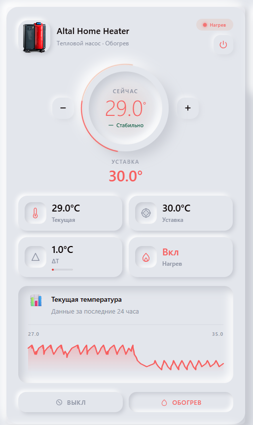

# Altal Heatpump Card



A premium neumorphic Home Assistant Lovelace card for the **Altal** heat pump.

## Features

- 🖼️ Hero image of the heat pump
- 🌡️ Real-time temperature display (current, target, ΔT)
- 🔥 Heating status with animated indicators
- 📊 ΔT diagnostic panel with smart analysis
- 🎛️ Climate controls (±, quick presets, HVAC modes)
- 🌗 Light & dark neumorphic themes
- ⚙️ Visual card editor

## Installation (HACS)

1. Open HACS → Frontend → **+ Explore & Download Repositories**
2. Add this repository as a custom repository (category: Lovelace)
3. Install **Altal Heatpump Card**
4. Add the resource if not added automatically

## Manual Installation

1. Download `altal-heatpump-card.js` from the [latest release](../../releases/latest)
2. Copy to `config/www/altal-heatpump-card.js`
3. Add resource: **Settings → Dashboards → Resources → Add**
   - URL: `/local/altal-heatpump-card.js`
   - Type: JavaScript Module

## Usage

```yaml
type: custom:altal-heatpump-card
name: Altal Heat Pump
climate_entity: climate.altal_home_heater
current_temp_entity: sensor.altal_current_temp
target_temp_entity: sensor.altal_target_temp
delta_t_entity: sensor.altal_delta_t
heating_entity: binary_sensor.altal_heating
image: /local/altal-pump.png
```

## Build from Source

```bash
npm install
npm run build
```

Output: `dist/altal-heatpump-card.js`
